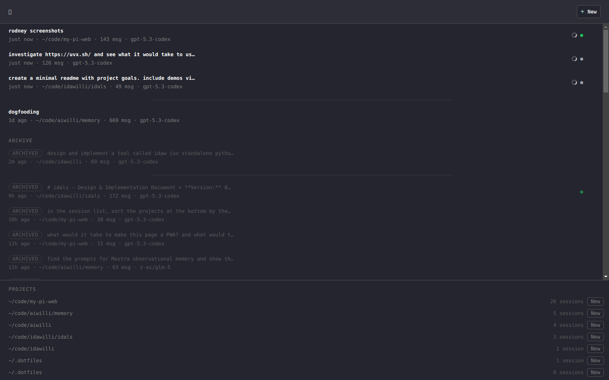
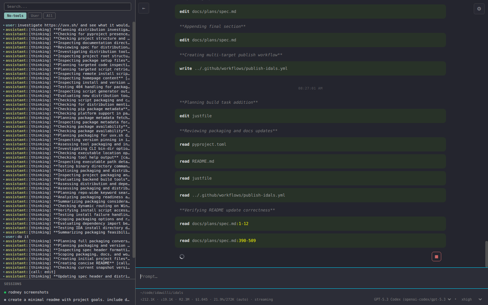
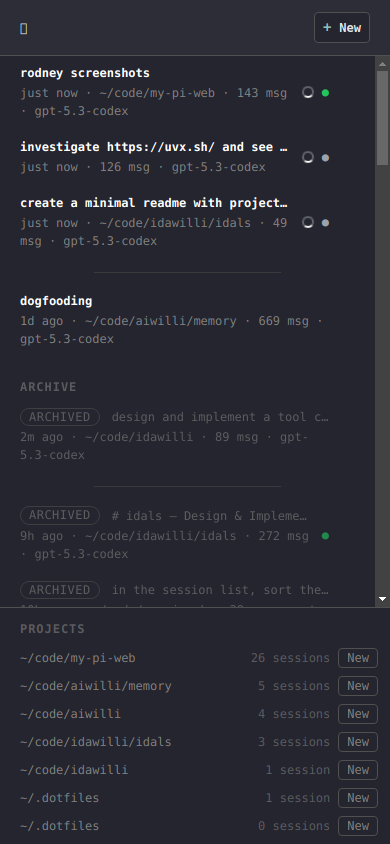
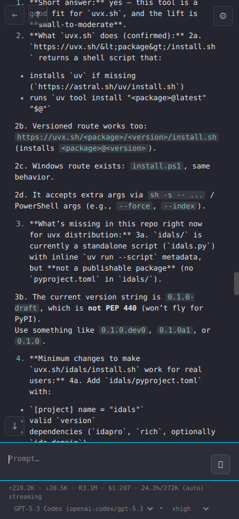

# Pizza

A self-hostable web interface for the Pi coding agent.

## Screenshots

Session list (desktop)



Session view (desktop)



Session list (mobile)



Session view (mobile)



## Setup

```
npm install
npm run dev
```

`npm run dev` runs the server and client together with hot reload, so changes to source files take effect immediately. It works on Windows, macOS, and Linux.

For production use, build and run separately:

```
npm run build
npm start
```
